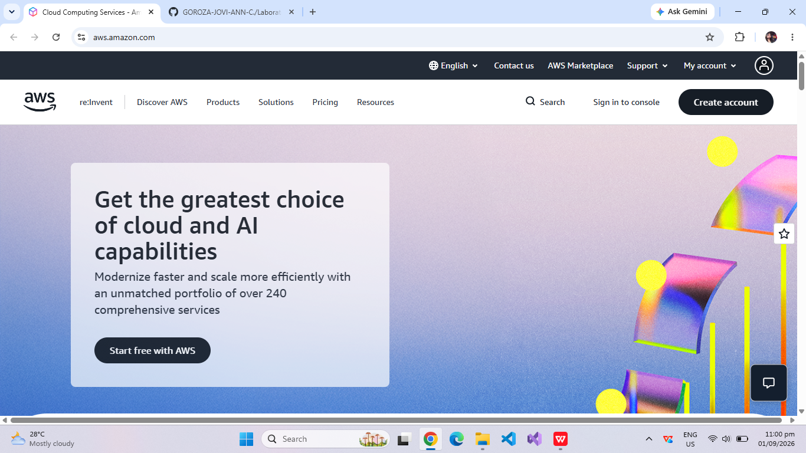

# Amazon Web Services (AWS) Research Report

## Brief Overview
Amazon Web Services (AWS) is a comprehensive and broadly adopted cloud platform provided by Amazon. Launched publicly in 2006, AWS offers over 200 fully featured services from data centers globally, serving millions of customers including fast-growing startups, largest enterprises, and leading government agencies.

## Global Infrastructure
AWS operates in multiple geographic regions worldwide. Each AWS Region consists of multiple isolated and physically separated Availability Zones (AZs). As of recent expansions, AWS spans dozens of geographic regions with over 100 Availability Zones globally, connected by low-latency, high-throughput network infrastructure.

## Cloud Management Console
The AWS Management Console is a web-based portal that allows users to manage their AWS resources visually. It features a customizable dashboard, search capabilities for services, and tools for access control and billing management.

## Four (4) Core Services
1. **Amazon EC2 (Elastic Compute Cloud):** Provides resizable compute capacity in the cloud as virtual servers.
2. **Amazon S3 (Simple Storage Service):** Scalable object storage designed for high durability, data backup, and analytics.
3. **AWS VPC (Virtual Private Cloud):** Allows users to provision a logically isolated section of the AWS Cloud to launch resources in a defined virtual network.
4. **AWS IAM (Identity and Access Management):** Enables secure management and fine-grained access control for AWS resources and services.

## Three (3) Advantages
* **Market Leader & Broadest Service Catalog:** Offers the deepest and most mature ecosystem of cloud tools and features.
* **Scalability and Reliability:** Built with high fault tolerance across globally distributed Availability Zones.
* **Flexible Pricing:** Offers pay-as-you-go pricing models, reserved instances, and spot instances for cost optimization.

## Typical Enterprise Use Cases
* Web and mobile application hosting at global scale.
* Big Data processing, data warehousing, and analytics pipelines.
* Enterprise disaster recovery and automated backup systems.
