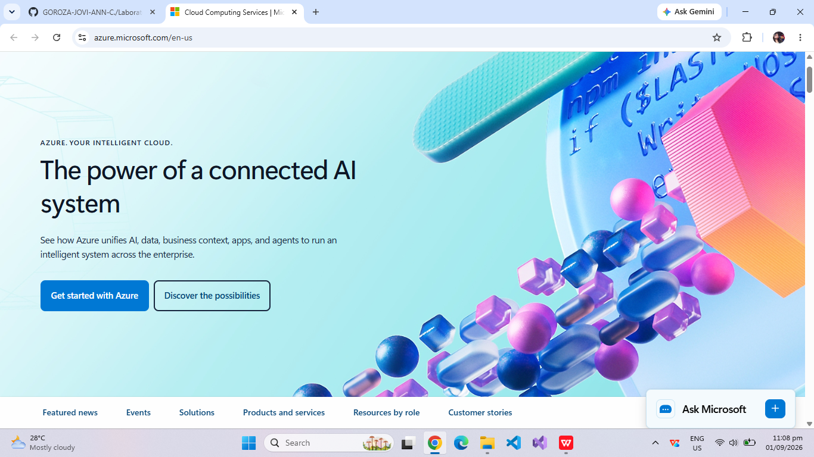

# Microsoft Azure Research Report

## Brief Overview
Microsoft Azure is a leading cloud computing platform developed by Microsoft, launched in 2010. Azure provides a wide array of cloud services including compute, analytics, storage, and networking, allowing organizations to build, deploy, and manage applications across a global network.

## Global Infrastructure
Azure boasts one of the largest global footprints among cloud providers, operating in over 60 regions worldwide. Its infrastructure utilizes availability zones and regional pairs to ensure redundancy, high availability, and compliance with local data residency regulations.

## Cloud Management Console
The Azure Portal is a unified, web-based console that provides a single point of interaction for managing Azure resources. It features customizable dashboards, clean resource group views, integrated cloud shell access, and detailed cost management metrics.

## Four (4) Core Services
1. **Azure Virtual Machines:** On-demand, scalable computing resources for running Windows or Linux virtual machines.
2. **Azure Blob Storage:** Massively scalable object storage solution for unstructured data such as files, documents, and media.
3. **Azure Virtual Network (VNet):** Enables Azure resources to securely communicate with each other, the internet, and on-premises networks.
4. **Microsoft Entra ID (formerly Azure Active Directory):** Cloud-based identity and access management service for user authentication and authorization.

## Three (3) Advantages
* **Seamless Microsoft Integration:** Native compatibility with Windows Server, Active Directory, Office 365, and SQL Server.
* **Strong Hybrid Cloud Capabilities:** Powerful hybrid management through solutions like Azure Arc and Azure Stack.
* **Enterprise Compliance:** Features extensive industry-specific security certifications and compliance coverage.

## Typical Enterprise Use Cases
* Enterprise hybrid cloud migration for existing Windows infrastructure.
* Large-scale enterprise resource planning (ERP) and SQL database hosting.
* Identity-driven enterprise application deployment and cloud-integrated SaaS management.
