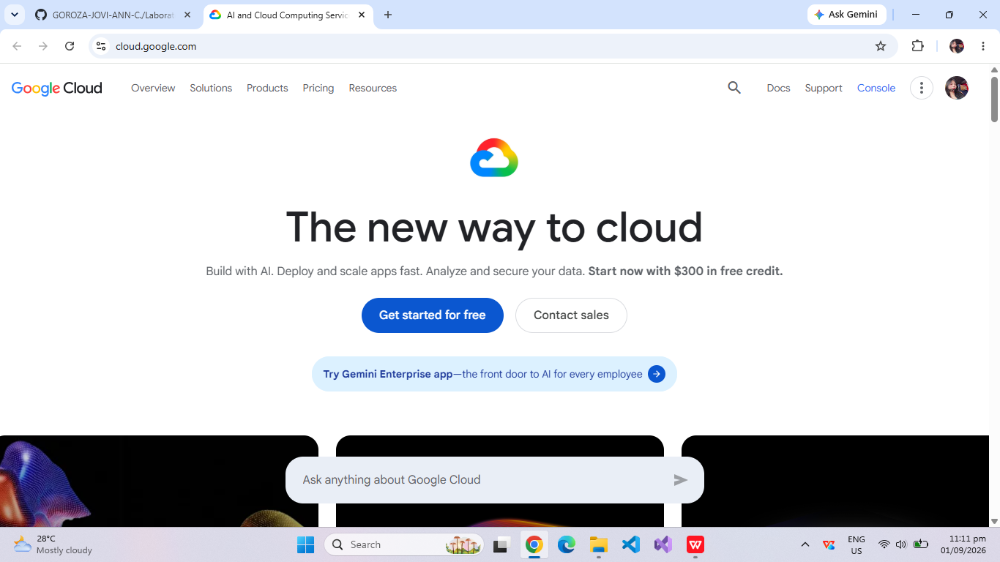

# Google Cloud Platform (GCP) Research Report

## Brief Overview
Google Cloud Platform (GCP) is a suite of cloud computing services offered by Google, publicly launched in 2008. Operating on the same infrastructure that Google uses internally for products like Search and YouTube, GCP delivers high-performance compute, storage, and data analytics tools.

## Global Infrastructure
GCP is structured into regions and zones distributed across the Americas, Europe, Asia-Pacific, and other global hubs. GCP operates a private fiber-optic network connecting its data centers, ensuring ultra-low latency and fast data transfer speeds across regions.

## Cloud Management Console
The Google Cloud Console provides a clean, web-based graphical interface for provisioning and monitoring GCP projects. It integrates a web-based Cloud Shell terminal, billing oversight tools, and detailed project-level resource navigation.

## Four (4) Core Services
1. **Google Compute Engine (GCE):** High-performance, customizable virtual machines running on Google’s infrastructure.
2. **Google Cloud Storage:** Unified, durable object storage for high-frequency access or long-term archiving.
3. **Google Kubernetes Engine (GKE):** Managed, production-ready environment for deploying containerized applications using Kubernetes.
4. **Google Cloud IAM:** Fine-grained access management environment to control authorizations across GCP resources.

## Three (3) Advantages
* **Industry Leader in AI & Machine Learning:** Advanced tools like Vertex AI and custom Tensor Processing Units (TPUs).
* **Premier Containerization Capabilities:** Native expertise in Kubernetes, as Google originally created the container orchestration platform.
* **High-Speed Global Backbone Network:** Fast data processing and low latency powered by Google's global fiber network.

## Typical Enterprise Use Cases
* Big Data processing, real-time streaming, and predictive analytics using BigQuery.
* Modern microservices architecture deployment via managed Kubernetes clusters (GKE).
* Machine Learning modeling, image recognition, and AI-driven data pipelines.
