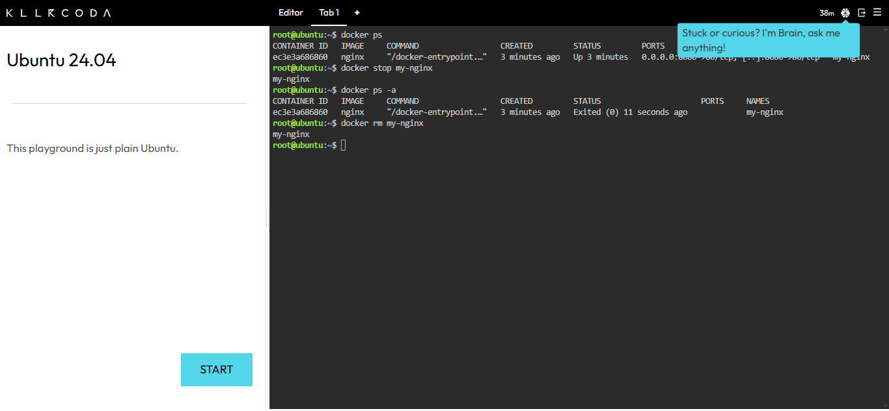

# Docker Deployment & Container Lifecycle Documentation

## Docker CLI Commands Executed

1. `docker ps`
   * **Explanation:** Displays a list of all currently active and running Docker containers.
2. `docker stop my-nginx`
   * **Explanation:** Gracefully halts the execution of the running container named `my-nginx`.
3. `docker ps -a`
   * **Explanation:** Lists all containers on the host system, including both active and stopped containers.
4. `docker rm my-nginx`
   * **Explanation:** Permanently removes the stopped container instance from the host system.

## Lifecycle Evidence

